Projex: Engineering Resource Management System
A full-stack application designed to manage engineering team assignments across projects. It helps track who’s working on what, their capacity allocation, and when they’ll be available for new projects, complete with role-based authentication and analytics.

Live Demo: Link to your deployed application

✨ Features
Authentication: Secure sign-up and login with distinct Manager and Engineer roles.

Project Management: Managers can create, edit, and delete projects with detailed fields like priority, due dates, and acceptance criteria.

Intelligent Assignment System:

Multi-step modal for creating projects and assigning engineers.

Seniority-based assignment rules (Managers can only assign to engineers of equal or lower seniority).

Capacity Tracking & Analytics:

Real-time capacity warnings during assignment to prevent over-allocation.

A dedicated "Team" dashboard for managers to view the workload and capacity of all engineers at a glance.

Role-Aware UI: The interface dynamically changes based on the user's role:

Managers see the full project and team overview.

Engineers see a personalized "My Profile" page where they can edit their skills and availability.

Responsive & Modern UI: Built mobile-first with a sleek, dark theme inspired by professional project management tools.

📸 Screenshots
Replace these with your own screenshots.

Login/Signup Page

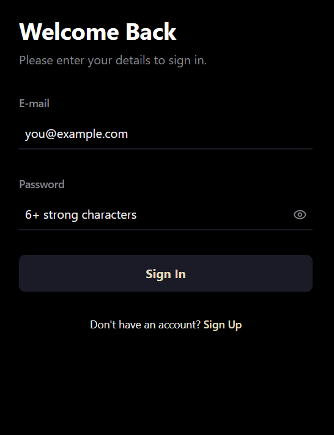

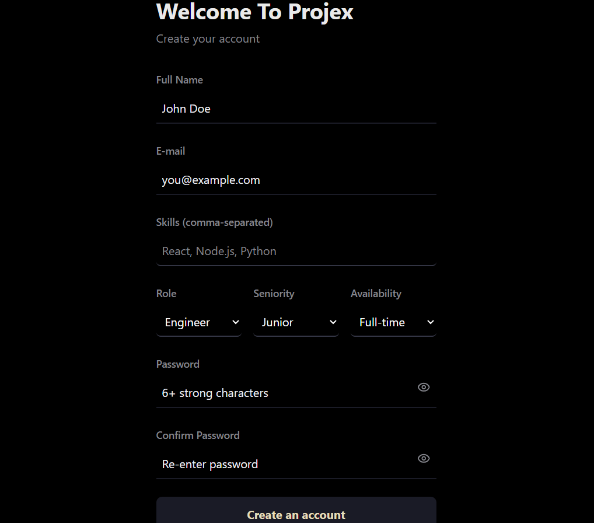

Dashboard (Manager View)

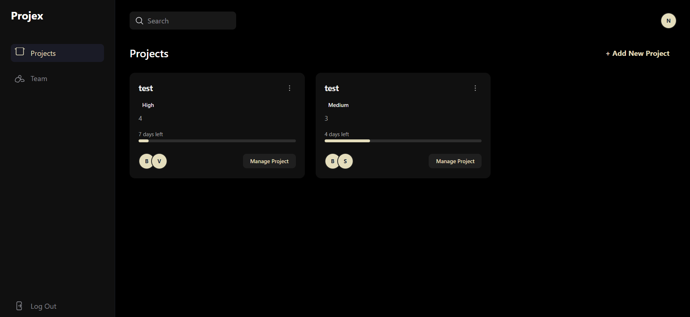

Team Capacity View

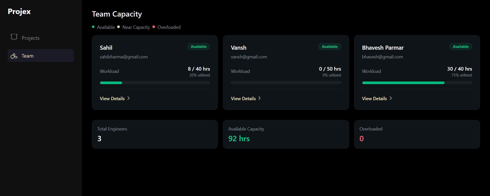

Detailed team member View

Create Project Modal

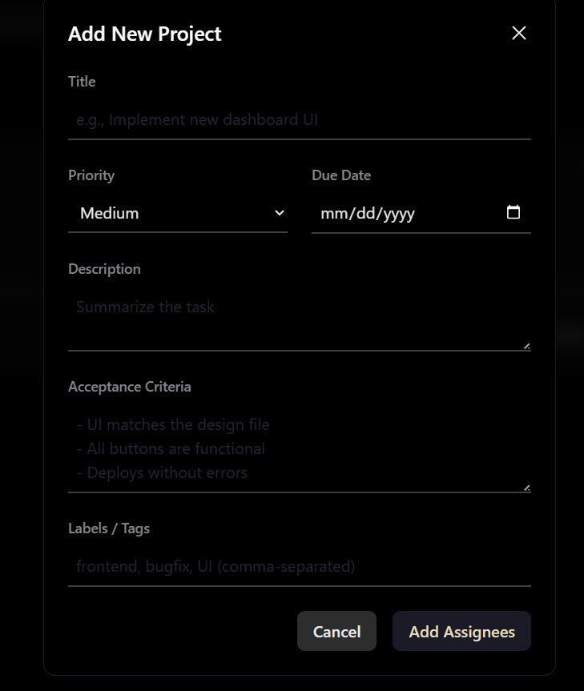

Manage Assignments Modal

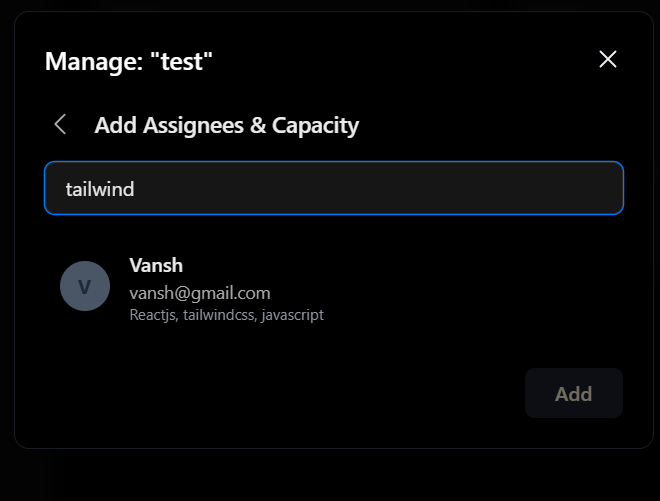

Manage Project Options

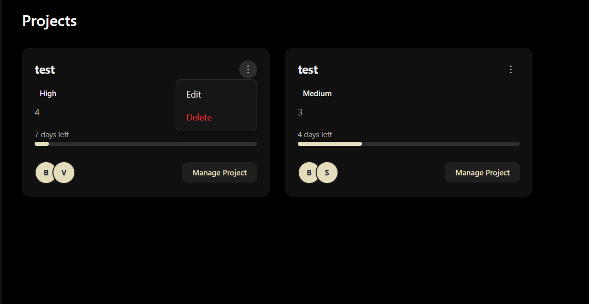

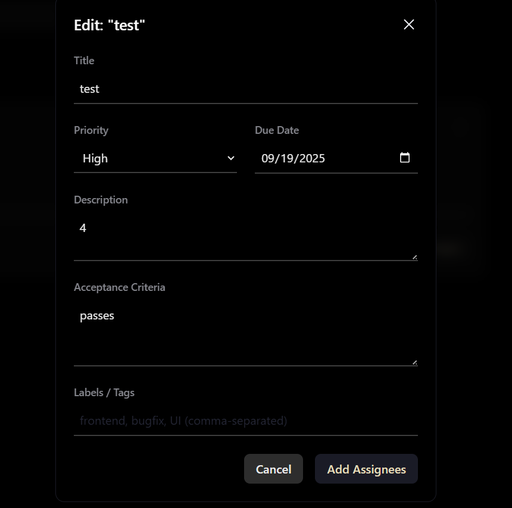

AI-Assisted Development Journey
This project was developed in close collaboration with an AI pair programmer, Google's Gemini. The AI was used as a tool to accelerate development, brainstorm architectural solutions, and debug complex issues.

Which AI Tools Were Used and How
Tool: Google Gemini and Copilot

Role: The AI acted as a hands-on development partner, responsible for generating boilerplate code, implementing UI components based on design prompts, architecting backend logic, and providing debugging assistance. The entire development process followed a conversational, iterative flow.

Specific Examples of AI Acceleration
Rapid UI Prototyping: The AI was given image prompts of the desired UI for the login page and the main dashboard. It translated these designs directly into functional React components with Tailwind CSS, saving significant time on styling and layout implementation.

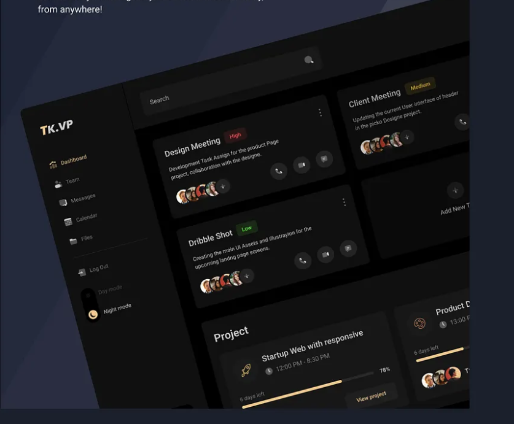

Complex Logic Generation: The AI architected and wrote the initial code for several core features, including:

The multi-step modal for creating a new project and adding assignees.

The seniority-based filtering logic in the AssigneeSelector component.

The denormalization logic in the backend controllers, which ensures that project summaries are kept in sync with the assignments collection for efficient data fetching.

Boilerplate and Hook Generation: Repetitive setup tasks were offloaded to the AI. This included generating the initial Node.js/Express server, all custom React hooks (useSignup, useProjects, useManageAssignments, etc.), and the setup for Firebase security rules.

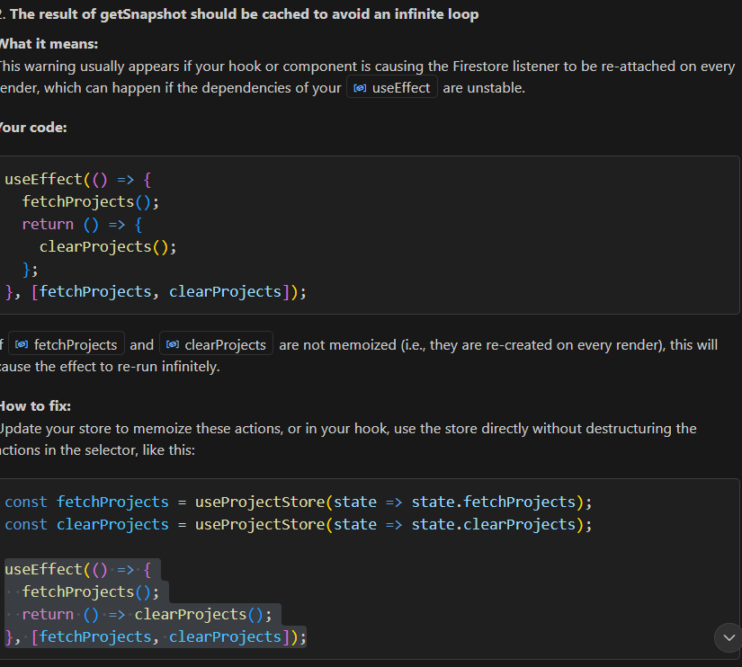

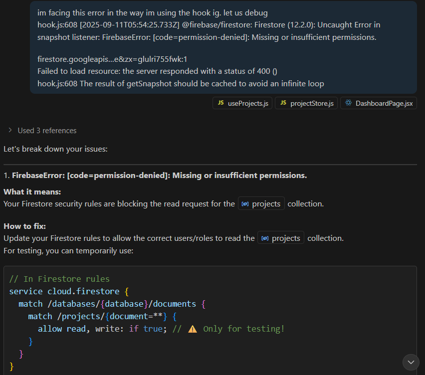

Challenges and Resolutions
Working with AI is a collaborative process, and it requires careful insight and debugging.

Challenge: Outdated Patterns. The AI initially provided setup instructions for an older version of Tailwind CSS.

Resolution: I provided the specific context that I was using Tailwind v4 with the Vite plugin. The AI immediately adapted and provided the correct, modern configuration using CSS variables in index.css and a simplified vite.config.js.

Challenge: Subtle Bugs & Logical Oversights.

The AI's initial implementation of a real-time profile page caused an infinite loop. I identified the symptom (increasing console errors), and the AI diagnosed the root cause (defining components inside a render function) and provided the corrected file structure.

A critical bug where the assignee count on project cards wasn't updating was identified. I pointed out the oversight, and the AI correctly identified the need for denormalization and implemented the required logic in the backend assignmentsController.

My Approach to Validating AI Suggestions
My approach was to treat the AI not as an infallible oracle, but as a highly productive junior developer that requires senior oversight.

Act as the Architect: I made the high-level decisions (e.g., "let's turn this form into a modal," "an engineer shouldn't edit their own seniority") and guided the AI to implement them.

Question the "Why": I frequently asked for clarification on the AI's architectural choices (e.g., "Why are we using hooks instead of putting everything in Zustand?"). Understanding the reasoning was as important as getting the code.

Incremental Testing & Debugging: I tested each feature immediately after the AI generated the code. When a bug was found (like a page reload on navigation or a permission error), I provided the error logs to the AI, which then diagnosed the issue and provided the fix. This tight feedback loop was essential.

Provide Clear Context: Supplying specific constraints, error messages, and even my own code snippets allowed the AI to generate more accurate and relevant responses, leading to a faster and more efficient development process.

Getting Started
Follow these instructions to set up the project locally on your machine.

Prerequisites
Node.js (v18 or later recommended)

npm or yarn

A Google Firebase account

1. Backend Setup
# Clone the repository
git clone <your-repository-url>
cd <repository-folder>/resource-manager-server

# Install dependencies
npm install

# Create the service account key
# 1. Go to your Firebase project settings -> Service accounts.
# 2. Click "Generate new private key".
# 3. Rename the downloaded JSON file to `engineering-resource-service-account-Key.json`.
# 4. Place this file in the `resource-manager-server` root directory.

# Start the server
npm start
# Or for development with automatic restarts:
# npm install -g nodemon
# nodemon index.js

The backend server will be running on https://projex-backend-897243952721.us-central1.run.app.

2. Frontend Setup
# Navigate to the client directory
cd ../resource-manager-client

# Install dependencies
npm install

# IMPORTANT: Your Firebase config is now handled by the vite.config.js and src/firebase/config.js
# You will need to add your Firebase client credentials directly into the `firebaseConfig`
# object in `src/firebase/config.js`.

# Start the client development server
npm run dev

The frontend application will be running on http://localhost:5173 (or another port if 5173 is busy).

👤 Author
Nishant Sharma

GitHub: [@your-github](https://github.com/nishantsh7)
